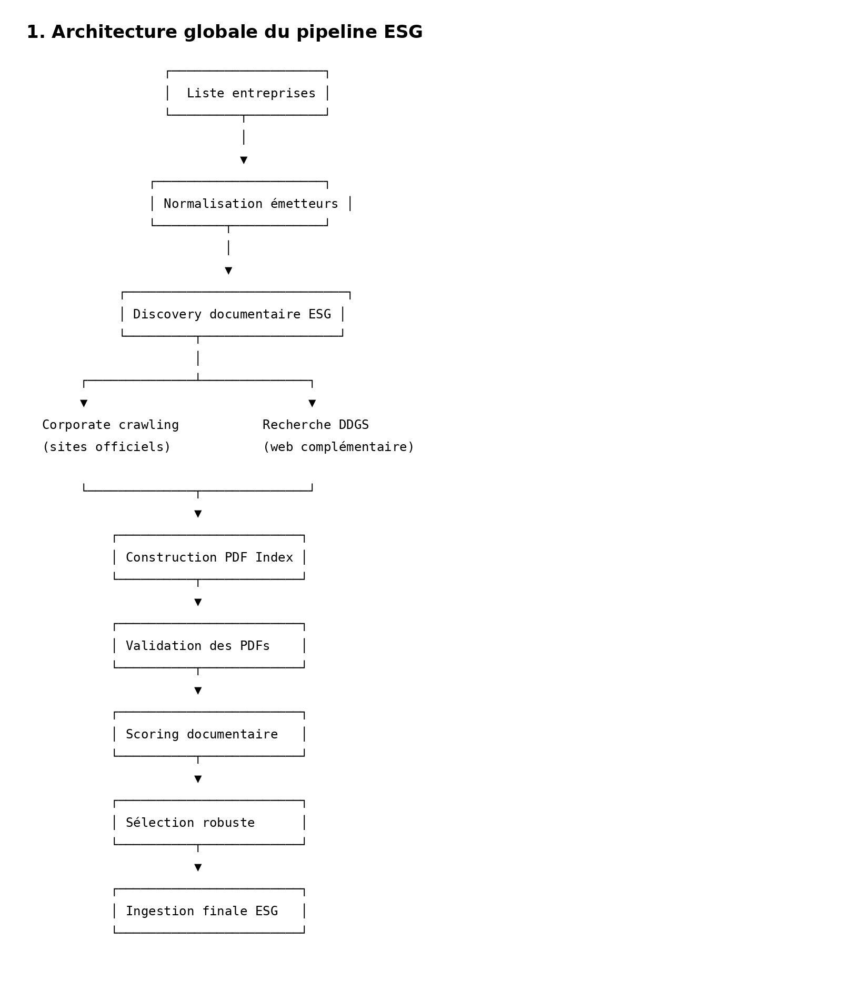
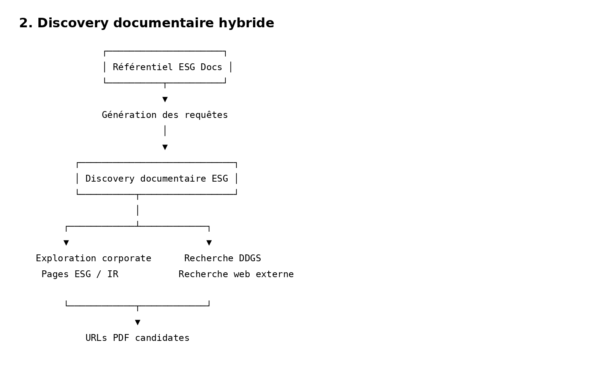
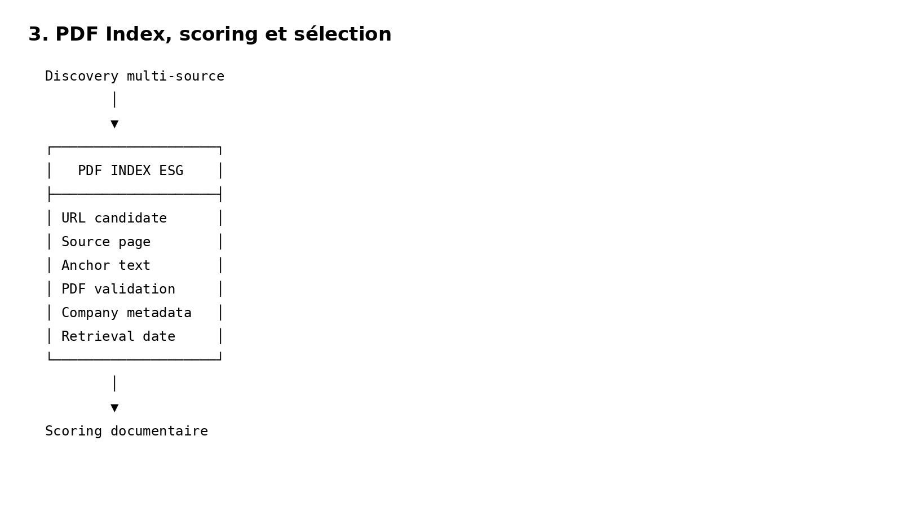
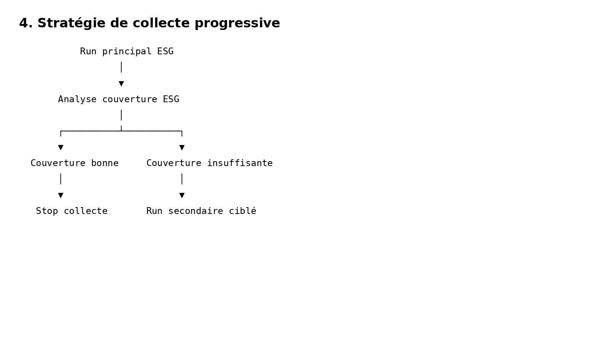

# Quantitative-ESG-Sustainable-Investing-Pipeline

## Présentation du projet 

Ce projet vise à construire une infrastructure de recherche ESG de bout en bout combinant :

- intelligence documentaire ESG,
- data engineering,
- extraction de données,
- scoring ESG,
- et méthodes quantitatives appliquées à l’investissement durable.

L’objectif final est de développer un pipeline capable de transformer des documents ESG bruts en signaux exploitables pour :

- l’analyse extra-financière,
- la construction d’indicateurs ESG,
- et la construction de portefeuilles durables robustes.

## Première étape du projet : Pipeline robuste de collecte documentaire ESG

La première phase du projet consiste à construire une architecture robuste permettant :

- la discovery automatisée de documents ESG ;
- la collecte multi-source ;
- la validation et la normalisation des PDFs ;
- le scoring documentaire ;
- la sélection robuste des meilleurs documents ;
- puis leur ingestion dans une base documentaire structurée.

Le pipeline a été conçu avec une logique :

- modulaire ;
- extensible ;
- reproductible ;
- et proche des architectures de data engineering utilisées dans des workflows ESG industriels.
  

  

  <em>Architecture globale du pipeline ESG : discovery, scoring, sélection et ingestion documentaire.</em>

  

### Fonctionnalités implémentées
#### 1. Gestion multi-source des documents ESG

Le pipeline accepte plusieurs modes d’entrée :

- noms d’entreprises ;
- URLs PDF fournies manuellement ;
- fichiers PDF locaux.

Cette flexibilité permet de compléter la collecte automatique lorsque certains documents sont difficiles à détecter.

#### 2. Discovery documentaire hybride

Le système combine :

- exploration directe des sites corporate ;
- et recherche web complémentaire via DuckDuckGo Search (DDGS).

Cette approche améliore significativement :

- la couverture documentaire ;
- la robustesse ;
- et la résilience du pipeline face aux architectures web hétérogènes.
  

  

  <em>Combinaison entre exploration corporate et recherche web complémentaire via DDGS.</em>

#### 3. Validation robuste des PDFs

Chaque document détecté est :

- validé techniquement ;
- contrôlé ;
- dédupliqué via SHA-256 ;
- puis normalisé avant ingestion.

Le pipeline gère notamment :

- les erreurs réseau ;
- les timeouts ;
- les faux PDFs ;
- les fichiers corrompus ;
- et les doublons documentaires.

#### 4. Construction d’un index documentaire intermédiaire

Tous les PDFs candidats sont centralisés dans un pdf_index intermédiaire.

Cet index joue plusieurs rôles :

- centralisation des candidats documentaires ;
- suppression des doublons ;
- séparation entre discovery et scoring ;
- réduction des appels réseau ;
- auditabilité de la collecte.

Cette architecture facilite également :

- le debugging ;
- les relances partielles ;
- et l’amélioration future des modèles de scoring.
  

  

  <em>Centralisation des PDFs candidats avant validation, scoring et sélection robuste.</em>

#### 5. Scoring documentaire ESG

Chaque document candidat est évalué automatiquement selon :

- le nom de l’entreprise ;
- l’année fiscale ;
- les mots-clés ESG ;
- le type documentaire attendu ;
- la cohérence avec la requête cible.

Le pipeline produit :

- un score documentaire ;
- une probabilité estimée ;
- un niveau de confiance ;
- ainsi que les raisons du scoring.

#### 6. Sélection robuste des documents

Le pipeline applique ensuite une logique de sélection robuste afin de distinguer :

- les documents automatiquement sélectionnés ;
- les documents nécessitant une revue manuelle ;
- les documents probablement absents.

Cette étape permet de réduire les faux positifs tout en maintenant une couverture documentaire élevée.

## Stratégie de collecte progressive

Le pipeline implémente une logique de collecte en deux niveaux :

### Run principal

Collecte des documents ESG prioritaires :

- rapports annuels ;
- sustainability statements ;
- rapports climat ;
- plans de vigilance ;
- rapports d’assurance.
- Run secondaire ciblé

### Collecte complémentaire activée uniquement lorsque la couverture documentaire principale est insuffisante :

- politiques ESG ;
- codes de conduite ;
- CDP ;
- SBTi ;
- présentations investisseurs ;
- rapports semestriels.

Cette approche permet :

- d’optimiser les coûts de collecte ;
- de limiter le bruit documentaire ;
- et de concentrer les ressources sur les cas réellement utiles.

  

  <em>Activation conditionnelle de la collecte secondaire selon la couverture documentaire ESG.</em>

# Deuxième étape du projet : Parsing multimodal et extraction robuste des métriques ESG

La deuxième phase du projet consiste à transformer les documents ESG collectés lors de la phase 1 en une base de données analytique structurée exploitable pour :

- le scoring ESG ;
- l’analyse quantitative ;
- l’analyse climat ;
- la construction de signaux d’investissement durable ;
- et la recherche empirique ESG.

Cette phase implémente un pipeline multimodal robuste capable d’extraire automatiquement des métriques ESG depuis :

- le texte libre ;
- les tableaux ;
- et potentiellement les images via OCR.

L’objectif est de construire une architecture :

- traçable ;
- robuste ;
- explicable ;
- extensible ;
- et adaptée aux contraintes réelles des documents ESG industriels.

## Architecture générale de la phase 2

Le pipeline suit une logique séquentielle structurée :

1. parsing multimodal des PDFs ;
2. segmentation documentaire ;
3. extraction des tableaux ;
4. extraction des images ;
5. OCR optionnel ;
6. extraction des métriques ESG ;
7. normalisation des unités ;
8. validation métier ;
9. scoring de confiance ;
10. revue manuelle ;
11. construction du panel entreprise-année-indicateur.

Cette architecture permet de conserver :

- la traçabilité complète des données ;
- les preuves documentaires ;
- les pages sources ;
- les extraits textuels ;
- et les niveaux de confiance associés à chaque métrique.

---

# Fonctionnalités implémentées

## 1. Parsing multimodal des documents ESG

Le pipeline parse automatiquement les PDFs ESG afin d’extraire :

- les pages ;
- les blocs textuels ;
- les tableaux ;
- les images embarquées.

Le parsing repose principalement sur :

- PyMuPDF ;
- pdfplumber ;
- Pillow ;
- pytesseract (OCR optionnel).

Chaque objet extrait est structuré dans une table dédiée afin de faciliter :

- les traitements ultérieurs ;
- les relances partielles ;
- le debugging ;
- et l’auditabilité complète du pipeline.

---

## 2. Segmentation documentaire en blocs analytiques

Les rapports ESG sont segmentés en blocs textuels structurés.

Chaque bloc conserve :

- son document source ;
- son numéro de page ;
- sa position ;
- son contenu ;
- et ses labels ESG éventuels.

Cette granularité permet :

- une extraction contextuelle robuste ;
- la conservation des preuves ;
- et une meilleure qualité de matching des métriques ESG.

---

## 3. Extraction robuste des tableaux ESG

Le pipeline extrait automatiquement les tableaux présents dans les rapports ESG.

Une logique spécifique permet ensuite :

- la détection des colonnes d’années ;
- l’identification des métriques ESG ;
- la récupération des valeurs ;
- la détection des unités ;
- et la normalisation des données.

Le système gère notamment :

- les tableaux partiellement structurés ;
- les variations de format ;
- les années multiples ;
- les unités ambiguës ;
- et les valeurs bruitées.

---

## 4. Extraction depuis texte libre

Certaines informations ESG importantes ne sont pas présentes dans des tableaux.

Le pipeline implémente donc une extraction contextuelle depuis :

- les paragraphes ;
- les blocs textuels ;
- les sections narrativisées ;
- et les plans de transition.

Cette extraction permet notamment d’identifier :

- des objectifs climat ;
- des taux de gouvernance ;
- des indicateurs RH ;
- des engagements Net Zero ;
- des objectifs SBTi ;
- ou des éléments de politique ESG.

---

## 5. OCR optionnel des images documentaires

Le pipeline prévoit une architecture OCR capable d’exploiter :

- graphiques ;
- captures ;
- tableaux scannés ;
- figures ESG.

L’OCR repose sur pytesseract lorsque l’environnement d’exécution le permet.

Le système a été conçu pour :

- fonctionner même lorsque l’OCR n’est pas disponible ;
- éviter les crashs pipeline ;
- et conserver une architecture extensible vers des OCR plus avancés.

Cette partie dépend néanmoins :

- des permissions système ;
- de la disponibilité du moteur Tesseract ;
- et de l’environnement d’exécution utilisé.

---

## 6. Registre centralisé des métriques ESG

L’extraction repose sur un registre ESG structuré contenant :

- les noms de métriques ;
- les alias ;
- les catégories ESG ;
- les unités attendues ;
- les bornes économiques plausibles ;
- les types de valeurs ;
- et les règles de validation.

Ce registre permet :

- une extraction cohérente ;
- la normalisation des unités ;
- et une validation métier homogène.

---

## 7. Validation métier et scoring de confiance

Chaque métrique candidate passe ensuite par une couche de validation robuste.

Le pipeline contrôle notamment :

- la cohérence des unités ;
- les bornes économiques ;
- la présence d’une preuve documentaire ;
- le type de source ;
- la plausibilité de la valeur ;
- et le niveau de confiance global.

Les métriques sont ensuite classées en :

- AUTO_VALIDATED ;
- REVIEW_REQUIRED ;
- éventuellement REJECTED.

Cette logique permet de conserver :

- la robustesse analytique ;
- l’explicabilité ;
- et la défendabilité du pipeline.

---

## 8. File de revue manuelle

Les candidats ambigus ou peu fiables ne sont pas supprimés brutalement.

Ils sont conservés dans une review queue dédiée contenant :

- la métrique ;
- le score ;
- les flags qualité ;
- les preuves documentaires ;
- et les raisons de revue.

Cette approche permet :

- une amélioration incrémentale du pipeline ;
- la supervision humaine ;
- et une meilleure gouvernance des données ESG.

---

## 9. Construction du panel entreprise-année-indicateur

La sortie finale de la phase 2 est un panel ESG analytique structuré.

Pour chaque couple :

- entreprise ;
- année fiscale ;
- métrique ESG ;

le pipeline conserve le meilleur candidat selon :

- le statut de validation ;
- le score de confiance ;
- et la qualité documentaire.

Le panel final contient notamment :

- les valeurs normalisées ;
- les unités harmonisées ;
- les preuves sources ;
- les pages d’origine ;
- les scores de confiance ;
- et les flags qualité.

Cette base constitue la fondation des prochaines étapes du projet :

- scoring ESG ;
- agrégation thématique ;
- construction de facteurs ESG ;
- analyse climat ;
- optimisation de portefeuille ;
- et recherche quantitative durable.

---

# Philosophie du pipeline

La phase 2 a été conçue avec une logique :

- industrialisable ;
- modulaire ;
- auditabile ;
- explicable ;
- et robuste aux documents ESG réels.

Le pipeline privilégie volontairement :

- la traçabilité ;
- la conservation des preuves ;
- la robustesse métier ;
- et la supervision humaine ;

plutôt qu’une extraction agressive difficilement défendable.

L’objectif n’est pas simplement d’extraire des données ESG, mais de construire une infrastructure quantitative ESG crédible et exploitable dans des workflows proches des standards institutionnels.
